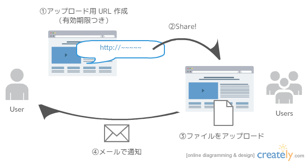
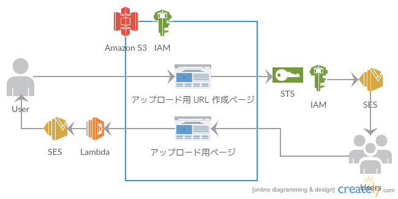

# JAWS DAYS 2016 ハンズオン - S3 を極限まで使い倒せ

## 何を作るのか

ファイルを送ってもらうための仕組みを作ります．

ユーザが有効期限付きのアップロードページを生成 (1) し，相手にその URL を通知 (2) します．

その後 URL を教えてもらったユーザがファイルをアップロード (3) すると，メールが届きます (4)．

## 前提知識

* JavaScript に関する知識
* JSON に関する知識

特に JavaScript については，問題が発生した際のトラブルシュートが楽になります．

## 使用するサービス

「S3 を使い倒せ」とありますが，ほぼ他サービスに頼ってしまっています（汗

S3 のファイル公開機能，特定のユーザからの特定のバケットへのアクセス制御，Lambda 連携などを使用します．

そのほか，一時的なアクセス権を取得するために STS を使用して AssumedRole を取得したり，SES を用いてメールを送ったりもします．

## 手順

1. S3 バケットの作成
1. SES の設定
1. IAM の設定
1. Lambda の設定
1. アップロード用 URL 生成のための HTML ファイル作成
1. ファイルアップロード用の HTML ファイル作成

## やってみよう
### S3 バケットの作成

### SES の設定

### IAM の設定

### Lambda の設定

### アップロード用 URL 生成のための HTML ファイル作成

### ファイルアップロード用の HTML ファイル作成
